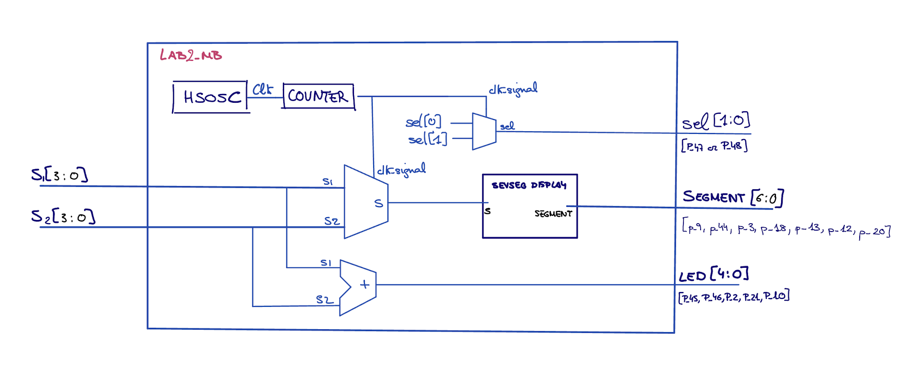
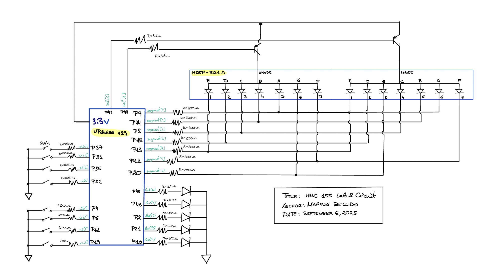
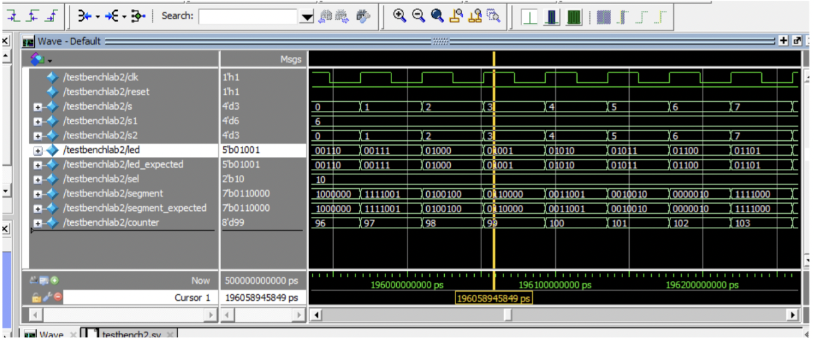
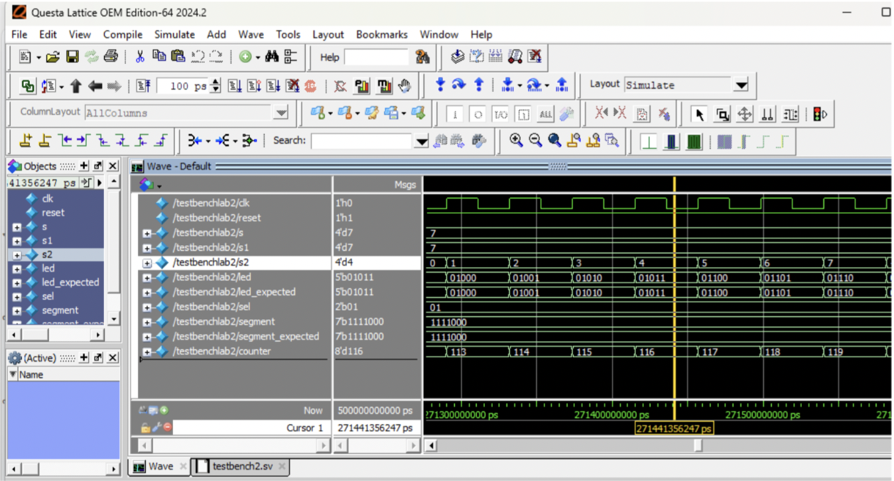
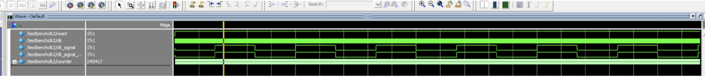
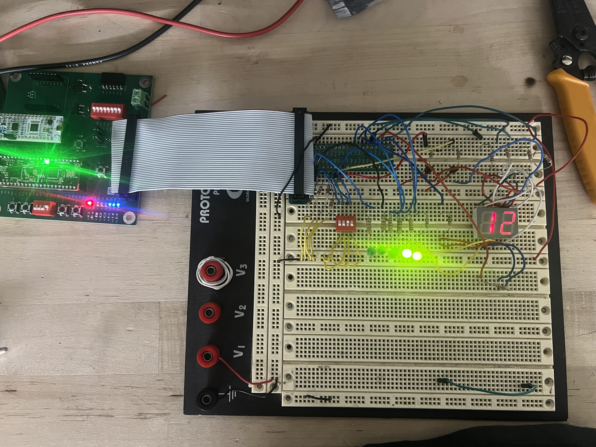

## Introduction

In this lab, an FPGA design was created to read two 4-bit binary inputs from switch sets and display them on a 2-digit seven-segment display. The circuit also calculates the sum of the two numbers and outputs it in binary using five LEDs. To minimize hardware usage, time multiplexing is employed so that both digits can be shown with a single decoder module and shared output pins.

## Design and Testing Methodology

For this lab I build from lab 1. I already had my 7-segment display decoder and the counter, which I editted to run at a frequnecy of 60KHz (Bc it's a frequency humans can't detect, so you wouldn't be able to perceive the shifting between the two displays). On top of that, I added an adder for the LEDs addition. 
I had my two DIP switches as inputs and used the counter producing that slower clock to alternate which set of switches is sent to the 7-segment decoder and ensures that the appropriate anode is activated.

## Technical Documentation:

My code can be found here  [Github Source](https://github.com/Marina-Bellido/E155-labs-code/tree/main/lab2)

### Block Diagram

|       SystemVerilog Module     |   Description   |
|--------------------------------|--------------------------------|
|            lab2_mb.sv          |    Top module with adder, counter, and input selection      |    
|              sevseg            |   7-segment display decoder       |     

### Schematic 

- Internal 100 k pullup resistor for the DIP switches so they are not floating.
- The PNP transistors [datasheet](https://hmc-e155.github.io/assets/doc/2N3906-D.pdf) specifies that we want a current of less than 1mA if the max Ic we can deliver to the 7-seg display is 20mA (Datasheet: (IC = 10 mAdc, IB = 1.0 mAdc). Also have a forward voltage from the PMP transistor of 0.6. This would give us a voltage drop of 2.6 and any resistor above 2.6kohms would satisfy our constraints. I chose 3kohms.
- The LEDs in the 7-segment display have a voltage drop of 1.8 V (datasheet), and the PMP has a Vcesat of 0.25. Therefore, to satisfy the constraint of less than 8mA, our resistor value must be above 156.25ohms. I choose a current-limiting resistor of 200 ohms. [Datasheet:](https://hmc-e155.github.io/assets/doc/MAN64x0%20Series.pdf)
- The output sum LEDs have a voltage drop of 2.35 V (datasheet), so 120 current-limiting resistors were selected in order to achieve a current below 8mA.

## Results and Discussion

### Testbench Simulation

Figure 3 and 4 show the QuestaSim simulation validating my Sytem Verilog code. 

Figure 5 shows the QuestaSim simulation validating how everytime clk_singal is shifting between the two display numbers.

## Conclusion

The design correctly displays two digits on the seven-segment display simultaneously using only one set of pins through time-multiplexing. The LEDs accurately represent the sum for all input values. When implemented on the FPGA, the circuit functions as expected and fulfills all intended objectives and specifications.

Above you can observe how the one switch is turned on to 1 and the other to 2 as can also be observed on the two display. The leds also add to light up the two right most leds, which would be the binary addition of the two segments (3).

## AI Sections 

My AI section can be found in the following link:  [AI SECTION](https://docs.google.com/document/d/1sZ6AG-33zuX3hVz_qwpRxkqVFeKj2ucXWRDyE-K4dxw/edit?usp=sharing)
