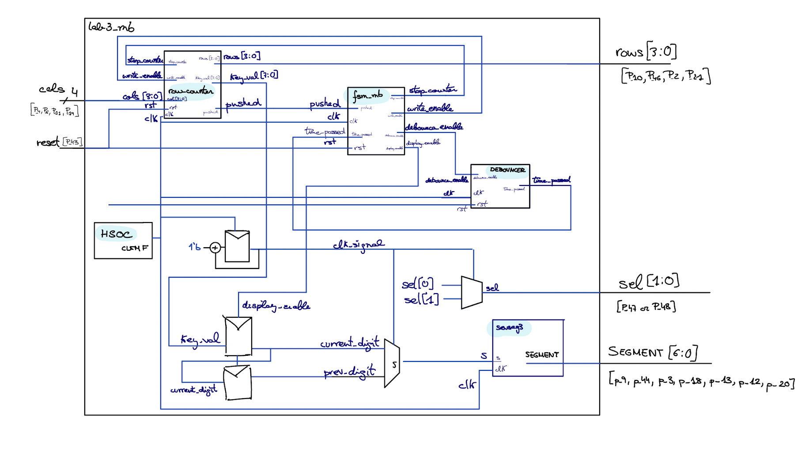
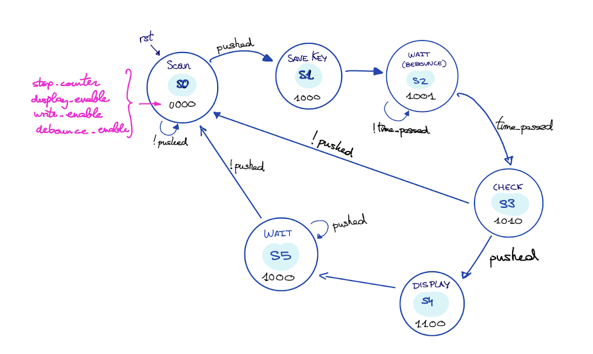
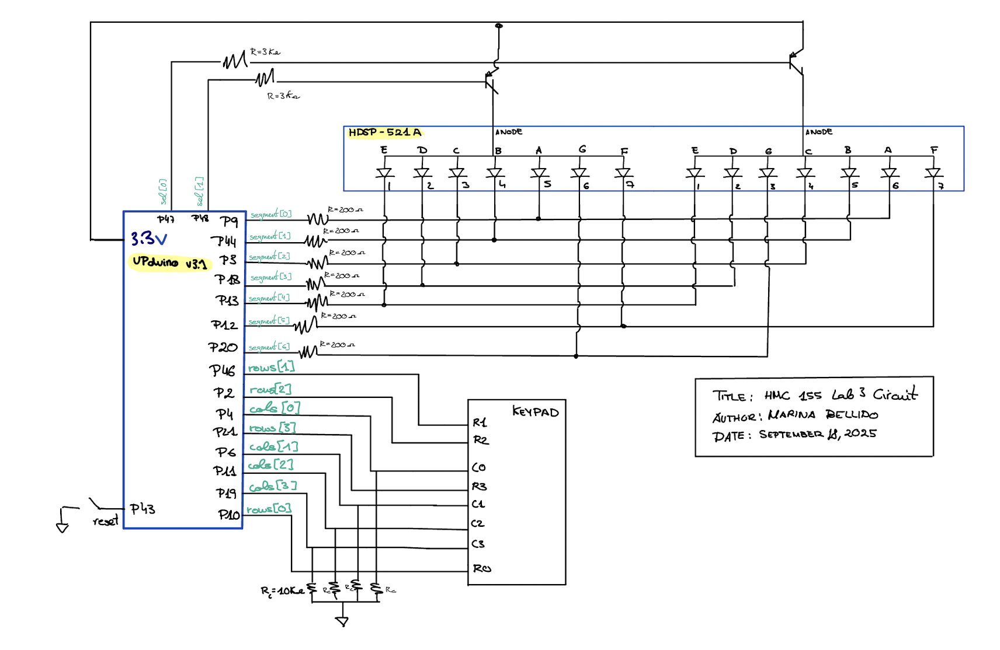
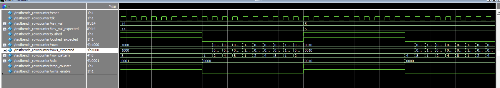
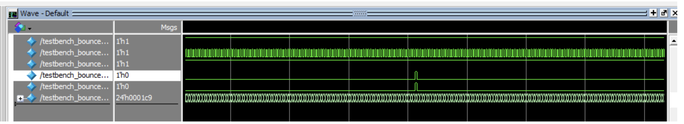
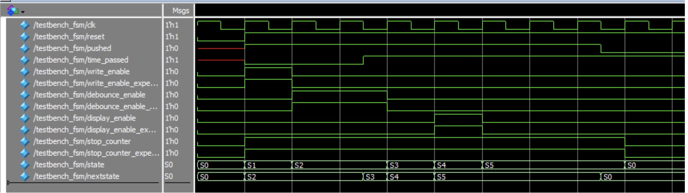
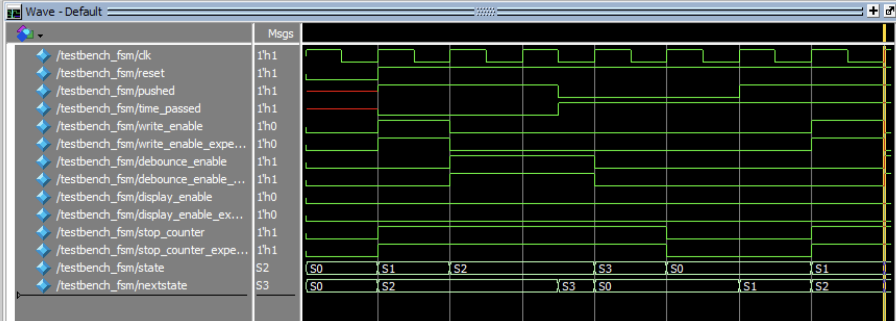
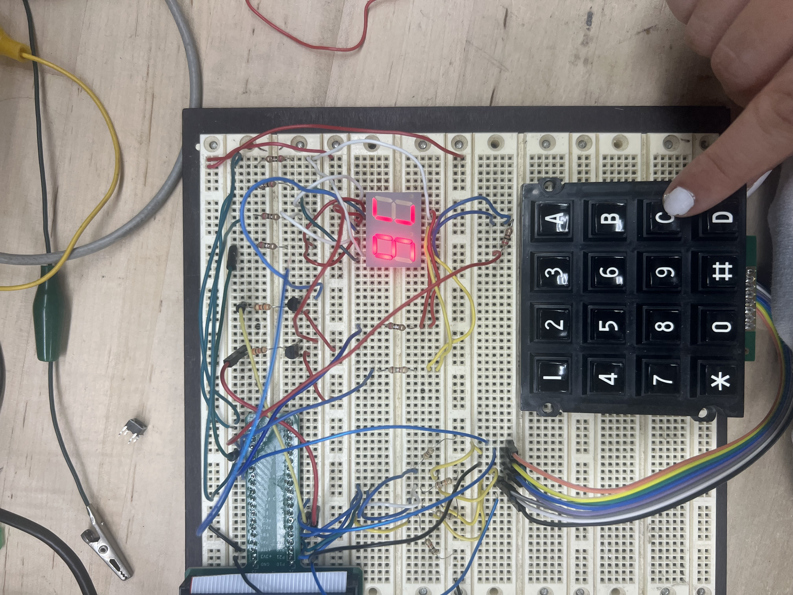

## Introduction
In this lab, an FPGA-based design was developed to scan a 16-button keypad and display the entered characters on a two-digit seven-segment display. The display shows two characters at a time, which remain visible until new inputs are received. The system is designed to handle switch bouncing and simultaneous button presses reliably.

## Design and Testing Methodology

My test was split into several modules. Look at table 1 so see in more detail all of the modules inputs and output. At a high level, I made a module for a controller finite state machine, the debouncer (which is a counter), the row_scanner for the keypad, and the 7-segment display. A synchronizer was also used to avoid metastability from the asynchronous inputs. I built on many of the modules from lab 2, such as the lab2_mb for the top module, and the 7-segment display module. The main design challenge came in the FSM, which also incorporated switch debouncing and the control logic to retain previous numbers. This is explained in more detail in the FSM section.

The physical design was setup to ensure that the maximum current from the FPGA pins was not exceeded, which necessitated the use of transistors to drive the 7-segment displays. The keypad was setup to use pull-down resistors so that whenever I pressed a column than I would output a 1. To do so, I connected all of my inputs (cols) to 10Kohms resistors. 

The Verilog modules were tested using several testbenches using assert statements covering a variety of different possible inputs. It did not seem necessary to test every possible input combination as that number quickly explodes. The physical design was tested using a wide range of different possible inputs.

## Technical Documentation

The source code for the project can be found in the associated [GitHub repository.](https://github.com/Marina-Bellido/E155-labs-code/tree/main/lab3/fpga/src) 

## Block Diagram

The block diagram in Figure 1 demonstrates the overall architecture of the design. The various modules are described here:

TABLE 1: Verilog Modules

|       SystemVerilog Module     |   Description   | Input     | Output|
|--------------------------------|--------------------------------|-------------------------------|-------------------------------|
|            lab3_mb.sv          |    Top module with HSOC timer, counter, and input selection    |    cols[3:0], rst               | rows[3:0], sel[1:0], segment[6:0] |
|              sevseg            |    7-segment display decoder                                   |   s                             | segment[6:0]                      |
|              row_counter       |    scanning the rows and checking if a columns has been pushed |     stop_counter, write_enable, cols[3:0], rst, clk | pushed, rows[3:0], key_val[7:0]  |
|              fsm_mb            |    FSM                                                         | pushed, clk, time_passed, rst   | stop_counter, write_enable, debounce_enable, display_enable| 
|              debouncer         |    counter to wait for switch debouncing                       |     debounce_enable, clk, rst   | time_passed                       | 

## Finite-State Machine

The following state transition diagram and table explain the operation of my FSM 

 
|       Current State	           |  Condition                     | NextState                      | 
|--------------------------------|--------------------------------|------------------------------- |
|            S0 (SCAN)           |    pushed = 1                  |    S1  (SAVE_KEY)              | 
|            S1  (SAVE_KEY)      |                                |    S2 (WAIT-Debounce)          | 
|            S2 (WAIT-Debounce)  |    time_passed = 1             |    S3 (CHECK)                  | 
|            S3 (CHECK)          |    pushed = 1                  |    S4 (DISPLAY)                | 
|            S3 (CHECK)          |    pushed = 0                  |    S0 (SCAN)                   | 
|            S4 (DISPLAY)        |                                |    S5 (WAIT)                   | 
|            S5 (WAIT)           |    pushed = 1                  |    S0 (SCAN)                   | 

|        State	                 |   stop_counter                 |   display_enable            |  write_enable               |  debounce_enable            | 
|--------------------------------|--------------------------------|-----------------------------|-----------------------------|-----------------------------|
|            S0 (SCAN)           |       0                        |         0                   |     0                       |         0                   |  
|            S1 (SAVE_KEY)       |       1                        |         0                   |     0                       |         0                   |  
|            S2 (WAIT-Debounce)  |       1                        |         0                   |     0                       |         1                   |  
|            S3 (CHECK)          |       1                        |         0                   |     1                       |         0                   |  
|            S4 (DISPLAY)        |       1                        |         1                   |     0                       |         0                   | 
|            S5 (WAIT)           |       1                        |         0                   |     0                       |         0                   |   

## SCHEMATIC

Figure 3 shows the physical layout of the design. I haven't drown the switches for the keypad since they are internal to the hardware.

## Results and Discussion

### Testbench Simulation

I have attached questa simulations of all the testbenches created for my modules.

When in S3 pushed=1, go continue and in S5 pushed =0, so go back to S0: CORRECT

When in S3 pushed=0, go back to S0: CORRECT

## Conclusion

The design successfully displays two digits on the 7-segment display based on the characters that are input using the keypad. The numbers persist after the keys are released and cycle off to the left as new keys are pressed.

## AI Sections 

My AI section can be found in the following link:  [AI SECTION](https://docs.google.com/document/d/1eS5TrrVyLWwtf728MhP1lih4kMDV9gXcLqWXCxVBr3A/edit?usp=sharing)
