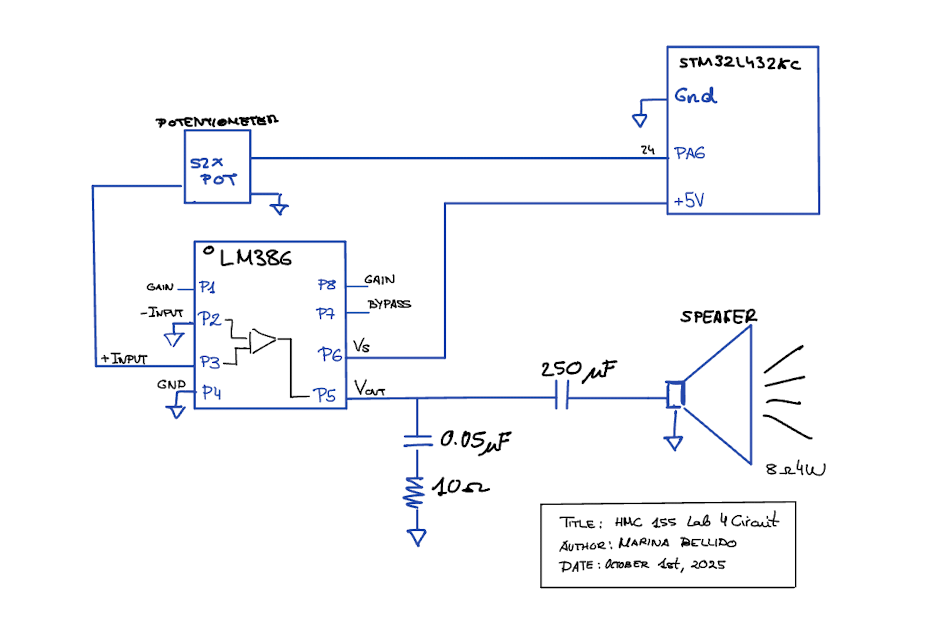
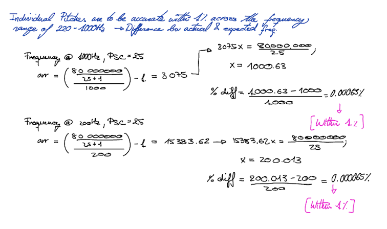
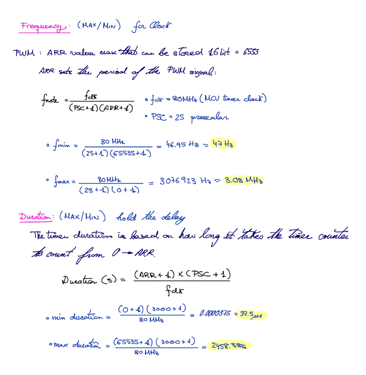

## Introduction

In this lab, an ARM microcontroller (STMLK324KC microcontroller) was programmed to drive a speaker and play two different songs. The objective was to become familiar with the MCU’s memory-mapped I/O and timer peripherals. The implementation plays the given song, Für Elise, as well as an additional selection of my choice, which was the Minecraft song.

## Design Methodology

I based my implementation on several example libraries from the course, making a number of modifications specific to this lab. The GPIO and RCC libraries were used almost unchanged, but I built the timer and PWM libraries from scratch. To do so, I had to carefully read and understand both the datasheet and the reference manual.
I configured two timers (TIM15 and TIM16): one in standard count-up mode and the other in PWM mode. The PWM timer was used to generate the desired output frequency, with the duty cycle fixed at 50% to avoid distorting the sound. Configuring both timers required careful selection of register values to ensure they could play the full range of frequencies and sustain them for the correct durations.
The datasheet was essential, as it specified which bits in the RCC register enable the timers’ clocks. It also explained how to configure a timer for PWM mode and route its output to a GPIO pin connected to the speaker. From there, I could also use the counter setup to control delays and note durations.

## Technical Documentation:
The source code for the project can be found in the associated [GitHub repository.](https://github.com/Marina-Bellido/E155-labs-code/tree/main/lab4/fpga/src) 

### Schematic 

The schematic above shows the circuit connected to our speaker. We used an LM386 low-voltage audio power amplifier to take the PWM signal from a GPIO pin on the MCU and drive the speaker to produce sound. The resistor and capacitor values were chosen based on the LM386 datasheet recommendations. Additionally, a potentiometer was included to adjust the speaker’s output volume.

## Timer Calculations

## Results 

<video width="600" controls>
  <source src="images/IMG_9581.MOV" type="video/mp4">
  Your browser does not support the video tag.
</video>

## Conclusion
The design successfully outputs two songs in sequence through a speaker, with a potentiometer providing volume control. All pitches and frequencies are generated accurately.

Conclusion

The overall design works as expected, and we are able to play Fur Elise and another song of our choice on the speakers, by using the MCU clock to generate a PWM frequency for the tone, as well as for a delay timer. In other words, our PLL clock goes to two timer busses to generate a PWM signal for our frequency and create a timer for our audio. Overall, I spent 20 hours on this lab.

## AI Sections 

My AI section can be found in the following link:  [AI SECTION](https://docs.google.com/document/d/1HOM4KU_rjUMDl5ZWsrAqtAZ-Khf6BMVKil241aD9XFU/edit?usp=sharing)
