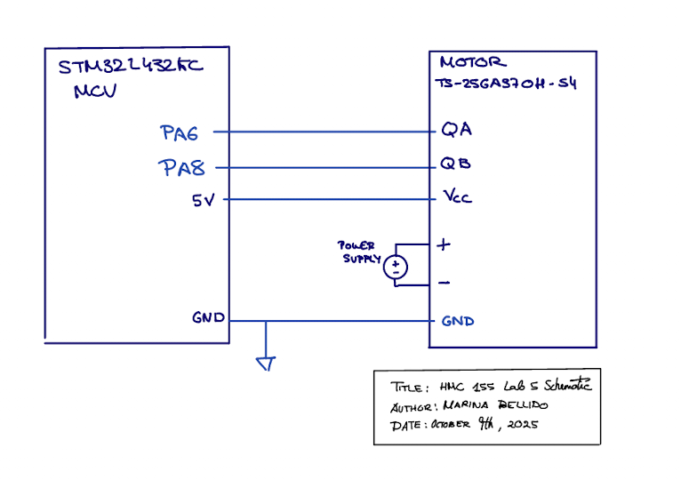
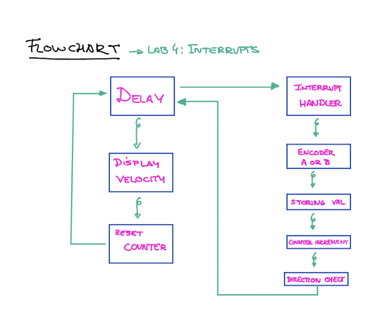
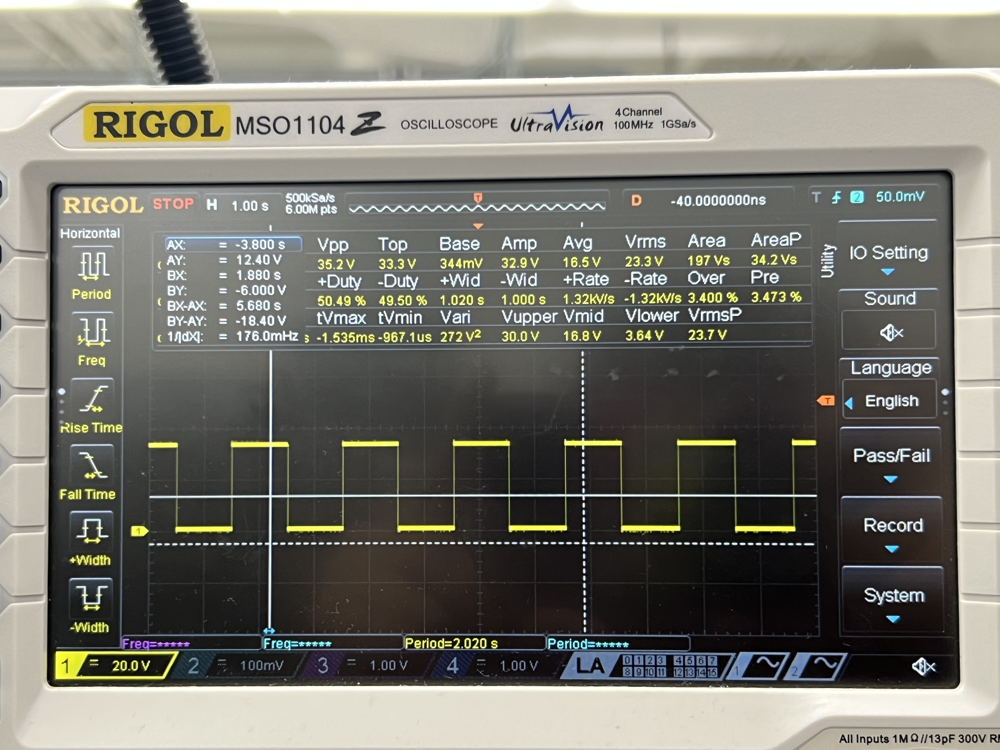
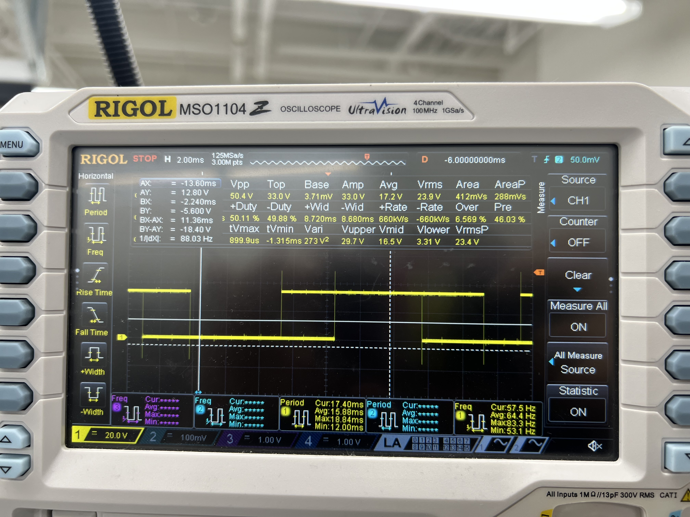
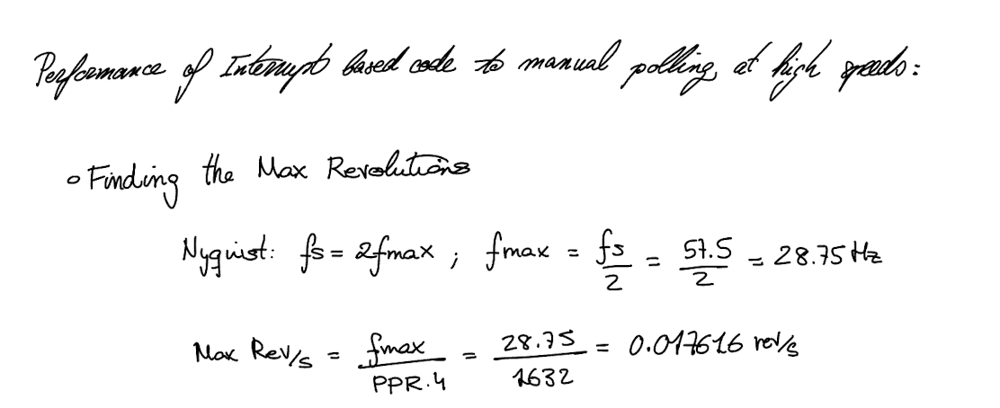

## Introduction

In this lab, we utilized an ARM microcontroller to determine a motor’s rotational speed and direction through a quadrature encoder, with encoder pulses captured via interrupts to maintain precise and accurate measurements.

## Design Methodology

I based my design on several example libraries provided for this course, using the GPIO, RCC, and TIM libraries with minimal modification. Building on these, I implemented control for multiple EXTI interrupt controllers. 

For my design, I chose to use a single interrupt handler that responds to changes on either encoder channel. Each time the handler is triggered, it increments a pulse-count variable and updates the encoder’s current state, recording which channel changed and whether it was a rising or falling edge. The new state is compared to the previous state to determine the motor’s direction using quadrature logic, since the 90° phase difference between channels produces a unique transition pattern for clockwise versus counterclockwise rotation. A checkDirection function evaluates the transition to assign the correct direction. Using a timer, the number of pulses is measured every second. This count is divided by 1632 (the pulses per rotation × 2 channels × counting both rising and falling edges) to calculate the motor’s speed in revolutions per second. The pulse-count variable is then reset to start measuring the next interval.

This design uses interrupts to count the encoder pulses, which is more accurate and avoids the tricky task of setting up multiple timers with different frequencies. Only one timer is needed, and it’s used just to check how many pulses occurred every second. The timer runs at a 1 ms rate, so a simple delay_millis function is enough to measure the one-second intervals.

## Technical Documentation:
The source code for the project can be found in the associated [GitHub repository.](https://github.com/Marina-Bellido/E155-labs-code/tree/main/lab5) 

### Schematic 

A 25GA-370 DC Motor was used as the motor/encoder for this lab.[Datasheet HDSP-511x](https://hmc-e155.github.io/assets/lab/25GA370.pdf)

### Flowchart 

The main loop is executing on the left and the interrupt handler that is triggered whenever an encoder channel pulses is on the right.

## Result and Discussion
To test my motor, I connected it to a power supply and adjusted the voltage while it was attached to my circuit. I initially ran the motor at very low speeds in both directions to visually verify that the reported rotation direction matched the actual movement, which it did. I also connected the encoder channels to an oscilloscope and saw how the interaction with the interrupt handler was occurring.

I also compared the performance of interrupt based code to manual polling at high speeds:

### Interrupt Vs polling
It’s comparing two ways your microcontroller (MCU) can detect signals coming from your encoder (or any input pin):

  - Polling – constantly checking the pin to see if it changed.
  - Interrupts – letting the MCU automatically react when the pin changes.
  

In the polling method, the MCU repeatedly checks the state of the input pin in a continuous loop to see if it has changed. This approach is simple to implement, but it can become inefficient because the MCU spends much of its time checking the pin instead of performing other tasks. More importantly, if the encoder signal changes faster than the MCU can check it, pulses may be missed, resulting in inaccurate measurements. In contrast, interrupts allow the MCU to automatically react whenever the pin changes state. When an interrupt is triggered, the MCU immediately pauses its current operations and jumps to a special function designed to handle that event. This ensures that no pulses are missed, even at high speeds, while also freeing the MCU to perform other operations when no encoder changes are occurring. Overall, interrupts provide a faster, more reliable, and more efficient way to handle encoder signals compared to polling.

## Conclusion
The design successfully reports the speed of a motor and its direction, updating every second. 

## AI Sections 
My AI section can be found in the following link:  [AI SECTION](https://docs.google.com/document/d/1Af7Omg_EQoWIgwVuT9reDqKRjXKuW_L3h550ZHszoJc/edit?usp=sharing)
