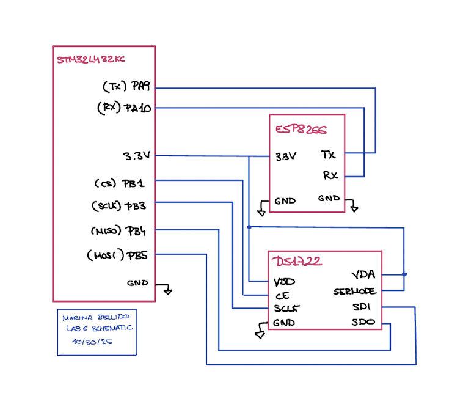
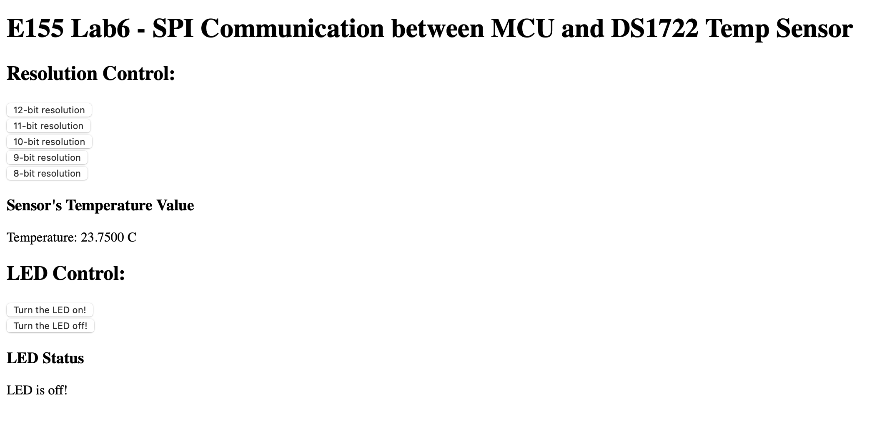

---
title: "Lab 6: The Internet of Things and Serial Peripheral Interface"
description: "Hours Spent on lab: 17 "
author: "Marina Bellido"
email: mbellido@hmc.edu
date: "10/30/25"

---

## Introduction

In this lab, an ARM microcontroller was used to interface with a DS1722 SPI-based temperature sensor. The measured data was designed to be transmitted via UART to an ESP8266 module hosting a web server with an HTML interface, allowing users to view real-time temperature readings and adjust the sensor’s precision. In essence, we built a simple IoT device that demonstrated end-to-end data acquisition and remote monitoring.

## Design Methodology

To build this system, I first needed to understand how SPI communication worked between the ARM microcontroller and the DS1722 temperature sensor. After studying the MCU’s reference manual, I configured the SPI settings—such as baud rate, data size, and duplex mode—and selected appropriate pins for SCLK, MISO, and MOSI, while using a manually controlled chip select (CS) pin. The DS1722 required a specific communication sequence: each transaction began by pulling CS high, sending a command byte (e.g., 0x80 for writes or 0x00–0x02 for reads), and then either sending or receiving data. For read operations, dummy bytes were transmitted to provide the necessary clock pulses for data output. Once communication was properly configured, I wired the MCU and sensor pins (SDO, SDI, SCLK, CS) and verified functionality by writing to and reading from the configuration register. I used an oscilloscope and logic analyzer to visualize data transfer on the MOSI and MISO lines, confirming correct timing and signal behavior. Finally, I tested the complete setup through the web interface by changing resolution settings from the HTML page and confirming that the configuration register updated as expected.

## Technical Documentation:
The source code for the project can be found in the associated [GitHub repository.](https://github.com/Marina-Bellido/E155-labs-code/tree/main/lab6) 

The DS1722 temperature sensor was used in SPI mode. [Datasheet HDSP-511x](https://hmc-e155.github.io/assets/doc/ds1722.pdf)]

### ESP8266 Web Server and MCU Interface
The ESP8266 acts as a WiFi-enabled web server that allows users to interact with the microcontroller through a simple HTML page. Instead of hosting a full HTTP server on the MCU, the ESP8266 handles all web communication, serving pages over WiFi using the HTTP protocol.
The ARM microcontroller sends webpage data and receives user requests through a UART serial connection (TX ↔ RX) at 125000 baud. When a browser connects to the ESP8266’s WiFi network (e.g., Lab6ESP_xx) and accesses http://192.168.4.1/, the ESP forwards the request to the MCU in the form /REQ:'...'. The MCU responds by sending an HTML-formatted webpage, which the ESP then displays.
This setup creates a compact IoT system where the MCU gathers and transmits data—such as temperature readings—to the ESP8266, which presents the information on a web interface accessible from any connected device.
[More information on this: Lab6 E-155 webpage](https://hmc-e155.github.io/lab/lab6/#esp8266-web-server)]
WEBSITE NAM: http://192.168.4.1/ledoff?

## Result 
### Schematic 

### SPI Trace

### HTML page

## Conclusion
The system successfully communicates with the SPI-based temperature sensor, configures its resolution, and retrieves temperature readings. Everything is displayed in a HTML page, were one can control an LED and the resolution of the temperature sensor reading. On the webpage, one can observe how the temperature increases if you place your finger on top to warm the sensor. 
I have been able to build a simple IoT device.

## AI Sections 
My AI section can be found in the following link:  [AI SECTION](https://docs.google.com/document/d/1Af7Omg_EQoWIgwVuT9reDqKRjXKuW_L3h550ZHszoJc/edit?usp=sharing)
